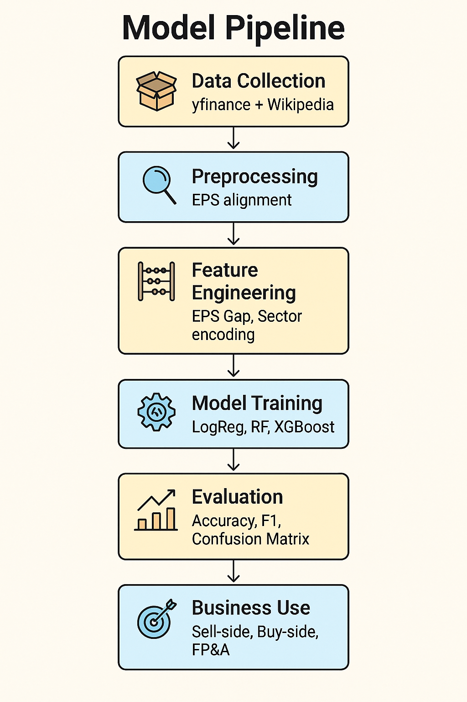

# 📈 Earnings Surprise Prediction | FP&A Forecasting Pipeline (S&P 500, XGBoost + SHAP)

A data-driven project that simulates a **Financial Planning & Analysis (FP&A)** use case: predicting whether **S&P 500 companies** will beat quarterly earnings expectations using public financial data and explainable machine learning.

## 🚀 Quick Demo

- ✅ Predict whether a company will beat EPS estimates using historical data
- 📉 Understand model drivers with SHAP
- 📊 Evaluate performance with confusion matrix and F1-score

> 🧠 **Use case**: Sell-side analysts, buy-side investors, and internal FP&A teams can use this model to anticipate earnings outcomes and improve forecast accuracy.

---

## 🧭 Project Overview

| Category | Details |
|----------|---------|
| 🎯 Objective | Predict if a company will report EPS > Estimate (binary surprise) |
| 🛠 Tools | Python, `yfinance`, `XGBoost`, `SHAP`, `scikit-learn`, `matplotlib`, `seaborn` |
| 📦 Dataset | S&P 500 companies' EPS Actual vs Estimate (2019–2024) |
| 📍 Output | Binary classification (`1 = beat`, `0 = meet/miss`) |

---

## 📂 Folder Structure
```
Python_earnings-surprise-prediction/
├── colab notebooks/   # Jupyter notebooks for modeling and analysis
├── requirements.txt   # Project dependencies
├── assets/            # Visualizations (confusion matrix, SHAP plots, etc.)
└── README.md          # Project overview and instructions 
```
---

## 🧮 Modeling Process



1. **Data Collection**
   - Pulled EPS actual/estimate from Yahoo Finance (`yfinance`)
   - Extracted sector, company name, and report dates (2019–2024)

2. **Feature Engineering**
   - EPS Gap (Actual − Estimate)
   - Surprise %
   - 1Y, 2Y EPS trends
   - Sector one-hot encoding
   - Binary label: `1` if EPS beat by >5%

3. **Modeling & Evaluation**
   - Benchmarked Logistic Regression, Random Forest, and **XGBoost**
   - XGBoost with `scale_pos_weight=0.5` yielded best balance

4. **Explainability (SHAP)**
   - Interpreted model with **SHAP Summary Plot**
   - Key drivers: `EPS Gap`, `Sector`, `YoY EPS Change`

---

## 📊 Results Snapshot

| Metric | XGBoost |
|--------|---------|
| Accuracy | 91.2% |
| F1-Score | 0.89 |
| SHAP Top Feature | `EPS_Gap`, `Sector_Tech`, `EPS_Trend` |

### 🔍 SHAP Summary Plot


---

### 📊 Confusion Matrices & Precision-Recall Curves


---

## 🎯 Decision Simulation & Strategic Use Cases

### 👩‍💼 Sell-Side Analyst
> Prioritize coverage for companies with high predicted EPS beats. Generate pre-earnings alerts for clients.

### 📈 FP&A Analyst
> Track industry benchmarks and recalibrate your company’s forecast model if peers show large surprise trends.

### 💰 Portfolio Manager
> Adjust exposure by flagging stocks with >70% negative surprise probability to avoid earnings dips.

---

## 🚀 How to Run

1. **Clone this repository**
   ```bash
   git clone https://github.com/Hanklin999/Python_earnings-surprise-prediction.git
   cd Python_earnings-surprise-prediction

2. **Install dependencies**
   ```bash
   pip install -r requirements.txt

3. **Run the notebook**
   ```bash
   jupyter notebook notebooks/earnings_surprise_colab.ipynb

---

## 🧠 Key Learnings

- Public data + light feature engineering can yield **strong forecast models**
- **Model explainability is critical** for business adoption
- **Sector-level encoding + SHAP** offers actionable insight for equity analysts and FP&A leaders

---

## 📬 Contact

**Hank Lin（林致翰）**

- 📧 Email: [chihhanlin99@gmail.com](mailto:chihhanlin99@gmail.com)  
- 🔗 [GitHub](https://github.com/Hanklin999)  
- 🔗 [LinkedIn](https://www.linkedin.com/in/hank-lin-a05189181/)  
- 🌐 [Portfolio (Notion)](https://four-elbow-906.notion.site/Personal-Project-Python-Earnings-Forecast-ML-208d839e9e7e8019aeb9e705ac9e0cc8?pvs=74)

